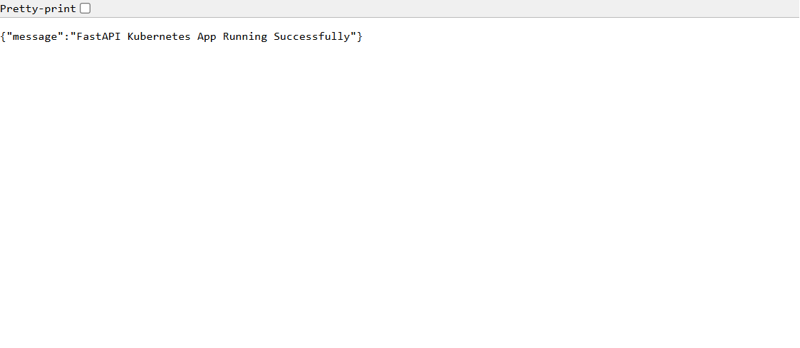

# k8s-fastapi-project

A minimal FastAPI application demonstrating containerization with Docker and orchestration with Kubernetes on Minikube. This project includes CI/CD automation via GitHub Actions.

---

## 📋 Project Overview

This project showcases the complete lifecycle of a containerized microservice:
- **Application**: FastAPI REST API
- **Containerization**: Docker for consistency across environments
- **Orchestration**: Kubernetes with Minikube for local development
- **CI/CD**: GitHub Actions for automated testing and validation

---

## 🏗️ Architecture & Key Concepts

### **What Docker is Doing**

Docker packages your application and all its dependencies (Python, FastAPI, Uvicorn) into a single **container image**. This ensures:
- **Consistency**: "It works on my machine" → it works everywhere
- **Isolation**: Each container has its own filesystem and dependencies
- **Efficiency**: Containers share the host OS kernel, making them lightweight compared to VMs

**In this project:**
- The `Dockerfile` specifies the Python 3.11 base image
- Dependencies from `requirements.txt` are installed once during image build
- The FastAPI app runs on port 8000 inside each container

### **What Kubernetes is Doing**

Kubernetes automates the deployment, scaling, and management of containerized applications across a cluster. It acts as an **orchestrator** that:
- **Schedules** containers onto nodes based on resource requirements
- **Monitors** container health and restarts failed ones automatically
- **Distributes traffic** across running instances
- **Scales** applications up or down based on demand
- **Updates** applications with zero downtime

**In this project:**
- `deployment.yaml`: Tells Kubernetes to run 2 replicas of the FastAPI container
- `service.yaml`: Exposes the pods to the network via a NodePort service
- Minikube provides a local single-node Kubernetes cluster for development

### **Why Replicas are Used**

Replicas ensure:
1. **High Availability**: If one pod crashes, others serve requests
2. **Load Distribution**: Multiple instances balance incoming traffic
3. **Rolling Updates**: You can update one replica while others serve users
4. **Self-Healing**: Kubernetes automatically replaces failed pods

**In this project:**
- `deployment.yaml` specifies `replicas: 2`
- Two FastAPI pods run simultaneously
- If one pod fails, Kubernetes automatically restarts it

### **What CI/CD Means**

**CI/CD** = **Continuous Integration** + **Continuous Deployment**

- **Continuous Integration (CI)**: Automatically test code on every push to catch bugs early
- **Continuous Deployment (CD)**: Automatically deploy tested code to production

**GitHub Actions** workflow (`.github/workflows/main.yml`):
- Triggers on push to `main` branch
- Checks out the code
- Sets up Python 3.11
- Installs dependencies (`pip install -r requirements.txt`)
- Verifies the code compiles (`python -m py_compile app.py`)
- Reports success or failure

This ensures only valid code reaches production.

---

## 📁 Project Files

| File | Purpose |
|------|---------|
| `app.py` | FastAPI application with a single `/` endpoint |
| `requirements.txt` | Python dependencies (FastAPI, Uvicorn) |
| `Dockerfile` | Container image definition |
| `deployment.yaml` | Kubernetes Deployment (2 replicas) |
| `service.yaml` | Kubernetes Service (NodePort on port 30425) |
| `.github/workflows/main.yml` | CI/CD pipeline |
| `README.md` | This file |

---

## 🚀 Quick Start

### **1. Local Development (No Docker/Kubernetes)**

```powershell
pip install -r requirements.txt
uvicorn app:app --reload
# Open http://127.0.0.1:8000
```

### **2. Docker (Containerized)**

```powershell
docker build -t fastapi-k8s-app .
docker run -p 8000:8000 fastapi-k8s-app
# Open http://localhost:8000
```

### **3. Kubernetes (Minikube)**

```powershell
# Start the cluster
minikube start --driver=docker --cni=bridge

# Load the image into Minikube
minikube image load fastapi-k8s-app

# Deploy to Kubernetes
kubectl apply -f deployment.yaml
kubectl apply -f service.yaml

# View the pods
kubectl get pods

# Open the service
minikube service fastapi-service
```

---

## 📊 Verification

### **Kubernetes Pods Running**

```
NAME                                 READY   STATUS    RESTARTS      AGE
fastapi-deployment-8694d5894-cdp6d   1/1     Running   1 (57s ago)   16h
fastapi-deployment-8694d5894-mn485   1/1     Running   1 (57s ago)   16h
```

### **Deployment Status**

```
NAME                 READY   UP-TO-DATE   AVAILABLE   AGE
fastapi-deployment   2/2     2            2           16h
```

### **Service Endpoints**

```
NAME              TYPE        CLUSTER-IP      EXTERNAL-IP   PORT(S)          AGE
fastapi-service   NodePort    10.101.140.25   <none>        8000:30425/TCP   16h
```

### **Application Response**



**Endpoint Response:**
```json
{
  "message": "FastAPI Kubernetes App Running Successfully"
}
```

---

## 🔄 Workflow

### **Local Development → Container → Kubernetes**

1. **Code**: Write the FastAPI app in `app.py`
2. **Test**: Run locally with `uvicorn app:app --reload`
3. **Containerize**: Build Docker image with `docker build -t fastapi-k8s-app .`
4. **Test Container**: Run and verify with `docker run -p 8000:8000 fastapi-k8s-app`
5. **Deploy to K8s**: Apply manifests with `kubectl apply -f deployment.yaml`
6. **Monitor**: Check status with `kubectl get pods`, `kubectl logs`, etc.
7. **Scale**: Increase replicas in `deployment.yaml` and reapply

### **CI/CD Pipeline (GitHub Actions)**

Every push to `main`:
1. Checks out code
2. Sets up Python environment
3. Installs dependencies
4. Verifies code syntax
5. Reports pass/fail status

---

## 🛠️ Commands Reference

| Command | Purpose |
|---------|---------|
| `minikube start --driver=docker` | Start Minikube cluster |
| `kubectl get pods` | List all pods |
| `kubectl describe pod <name>` | Get detailed pod info |
| `kubectl logs <pod-name>` | View pod logs |
| `kubectl apply -f <file>` | Deploy manifest |
| `kubectl delete -f <file>` | Remove deployment |
| `minikube service <service-name>` | Open service in browser |
| `kubectl port-forward svc/<service> 8080:8000` | Forward local port to service |
| `minikube stop` | Stop cluster |
| `minikube delete` | Delete cluster |

---

## 📚 Learn More

- **FastAPI**: https://fastapi.tiangolo.com/
- **Docker**: https://docs.docker.com/
- **Kubernetes**: https://kubernetes.io/docs/
- **Minikube**: https://minikube.sigs.k8s.io/
- **GitHub Actions**: https://docs.github.com/en/actions

---

## ✅ Project Status

- ✅ FastAPI app created and tested locally
- ✅ Dockerfile created and image built successfully
- ✅ Kubernetes manifests (Deployment + Service) created
- ✅ Deployed to Minikube with 2 running replicas
- ✅ CI/CD workflow configured in GitHub Actions
- ✅ Documentation complete
